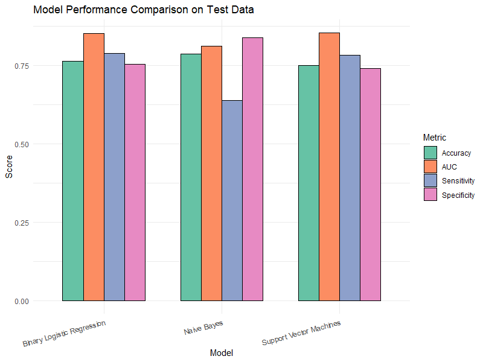

# Email Campaign Response Prediction Using Machine Learning

## Project Overview
This project applies supervised machine learning techniques in R to predict customer response to an email marketing campaign for a skin care clinic.  
Multiple classification models are developed and compared to identify the most effective approach for predicting campaign success.

## Business Context
A skin care clinic runs email marketing campaigns offering products and services.  
The goal is to identify customers who are **most likely to open the campaign email**, enabling more targeted and cost-effective marketing efforts.

## Objectives
1. Identify key factors influencing email campaign success  
2. Build and evaluate a **Binary Logistic Regression** model  
3. Compare Logistic Regression with **Naïve Bayes** and **Support Vector Machines**  
4. Evaluate models using ROC–AUC and classification metrics  

## Dataset
The dataset (`Email_Campaign.csv`) is included in the repository and contains customer-level marketing data.

### Dataset Description
Key variables:
- `Success` — campaign response (1 = email opened, 0 = not opened)  
- `AGE` — customer age group  
- `Gender` — gender (1 = Male, 2 = Female)  
- `Recency_Service` — days since last service purchase  
- `Recency_Product` — days since last product purchase  
- `Bill_Service` — service spending in the last 3 months  
- `Bill_Product` — product spending in the last 3 months  

## Analysis Workflow
1. Data import and validation  
2. Categorical variable encoding  
3. Binary Logistic Regression model development  
4. Feature selection and model refinement  
5. Multicollinearity diagnostics (VIF)  
6. Model evaluation using ROC curve, AUC, and confusion matrix  
7. Model comparison across Logistic Regression, Naïve Bayes, and Support Vector Machines

## Methods and Techniques
- Binary Logistic Regression
- Naïve Bayes classification
- Support Vector Machines (linear kernel)
- ROC curve and AUC analysis
- Confusion matrix evaluation
- Threshold optimization for imbalanced data
- Multicollinearity diagnostics (VIF)

## Key Findings
- **Recency** and **recent spending behavior** are the strongest predictors of email engagement  
- Customers with more recent purchases and higher spending are significantly more likely to open campaign emails  
- Logistic Regression and SVM achieved the **highest AUC (~0.85)**  
- Naïve Bayes achieved the **highest accuracy**, but with lower sensitivity, missing more positive responders  

## Visualization

## Tools and Skills
- R
- Classification modeling
- Logistic Regression
- Naïve Bayes
- Support Vector Machines
- Model evaluation (AUC, ROC, confusion matrix)
- Marketing analytics
- Predictive modeling

## How to Run the Project
1. Clone the repository  
2. Open the R script  
3. Ensure the dataset (`Email_Campaign.csv`) is located in the root directory  
4. Run the script sequentially  

## Notes
This project was completed for educational purposes and demonstrates the application of supervised machine learning models for marketing response prediction.
